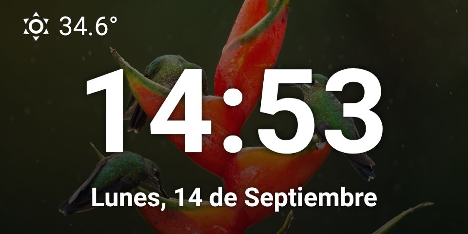

# Home Assistant Clock Dashboard

Fullscreen clock dashboard with a daily Bing Wallpaper background.



## Requirements

- Home Assistant 2026.x or newer.
- HACS.
- `custom:button-card`.
- Bing Wallpaper integration installed and configured.
- A weather entity named `weather.forecast_home`.

## HACS Dependencies

- Button Card:  
  https://github.com/custom-cards/button-card

- Bing Wallpaper:  
  https://github.com/ndesgranges/bing-wallpaper

## Installation

1. Install the dependencies through HACS.
2. Add this template sensors to `configuration.yml`:

   ```yaml
    template:
      - sensor:
          - name: "Time"
            unique_id: standalone_clock_time
            state: "{{ now().strftime('%H:%M') }}"
          - name: "Date"
            unique_id: standalone_clock_date
            state: >-
              {{ ["Lunes", "Martes", "Miércoles", "Jueves", "Viernes", "Sábado", "Domingo"][now().weekday()] }}, {{ now().day }} de {{ ["Enero", "Febrero", "Marzo", "Abril", "Mayo", "Junio", "Julio", "Agosto", "Septiembre", "Octubre", "Noviembre", "Diciembre"][now().month - 1] }}

   ```
4. Add the view in the raw editor of the view.
